# Pick Execution Service - Domain Model

## Overview

The Pick Execution Service domain model implements sophisticated warehouse picking operations using Domain-Driven Design. The model centers around the PickSession Aggregate which manages the entire pick workflow, with advanced path optimization through the TSP Solver and Path Optimizer.

## Class Diagram


## Entity Relationships


## Value Objects

### PickItem
```java
public class PickItem {
    private String productId;
    private String sku;
    private String description;
    private int quantity;
    private String unitOfMeasure;
    private double weight;
    private double volume;
    private boolean fragile;
    private Map<String, Object> attributes;
}
```

### PickResult
```java
public class PickResult {
    private String instructionId;
    private int pickedQuantity;
    private int shortQuantity;
    private String shortReason;
    private byte[] photo;
    private LocalDateTime timestamp;
    private Coordinates pickLocation;
}
```

### PathSegment
```java
public class PathSegment {
    private Location from;
    private Location to;
    private double distance;
    private long estimatedTime;
    private String travelMethod; // WALK, FORKLIFT, etc
}
```

### OptimizationCriteria
```java
public class OptimizationCriteria {
    private boolean minimizeDistance;
    private boolean minimizeZoneChanges;
    private boolean prioritizeUrgent;
    private boolean groupBySKU;
    private Map<String, Double> weights;
}
```

## Domain Events

```mermaid
classDiagram
    class PickEvent {
        <<abstract>>
        +String sessionId
        +String warehouseId
        +Instant timestamp
        +String operatorId
    }

    class PickSessionCreated {
        +SessionType type
        +List~String~ orderIds
        +int totalPicks
    }

    class PickSessionAssigned {
        +String operatorId
        +String operatorName
        +LocalDateTime assignedAt
    }

    class PickSessionStarted {
        +Location startLocation
        +PickPath optimizedPath
        +LocalDateTime startTime
    }

    class PickConfirmed {
        +String instructionId
        +int pickedQuantity
        +Location pickLocation
        +LocalDateTime pickTime
    }

    class PickShorted {
        +String instructionId
        +int requiredQuantity
        +int actualQuantity
        +String shortReason
    }

    class LocationSkipped {
        +String instructionId
        +Location location
        +String skipReason
        +Location nextLocation
    }

    class PathOptimized {
        +double originalDistance
        +double optimizedDistance
        +double improvement
        +PathStrategy strategy
    }

    class PathReoptimized {
        +String reason
        +Location failedLocation
        +PickPath newPath
    }

    class PickSessionCompleted {
        +LocalDateTime completionTime
        +SessionMetrics finalMetrics
        +int totalPicks
        +int successfulPicks
    }

    class PickSessionPaused {
        +String reason
        +Location currentLocation
        +int remainingPicks
    }

    class BatchCreated {
        +List~String~ sessionIds
        +int totalOrders
        +double estimatedSavings
    }

    PickEvent <|-- PickSessionCreated
    PickEvent <|-- PickSessionAssigned
    PickEvent <|-- PickSessionStarted
    PickEvent <|-- PickConfirmed
    PickEvent <|-- PickShorted
    PickEvent <|-- LocationSkipped
    PickEvent <|-- PathOptimized
    PickEvent <|-- PathReoptimized
    PickEvent <|-- PickSessionCompleted
    PickEvent <|-- PickSessionPaused
    PickEvent <|-- BatchCreated
```



## Aggregates and Boundaries

### PickSession Aggregate
- **Root**: PickSession
- **Entities**: PickInstruction, PickPath, PickNode
- **Value Objects**: Location, Coordinates, PickItem, SessionMetrics
- **Invariants**:
  - A session can only be in one status at a time
  - All picks must be confirmed or skipped before completion
  - Path must be optimized before starting
  - Cannot modify completed sessions

### Path Optimization Boundary
- TSPSolver operates independently
- PathOptimizer coordinates optimization strategies
- Results are immutable once calculated
- Re-optimization creates new path

## Domain Services

### TSPSolver
Core path optimization algorithms:
- `solveTSP()` - Basic TSP with start point
- `solveTSPWithZones()` - Multi-zone optimization
- `nearestNeighbor()` - Greedy initial solution
- `improve2Opt()` - Local search improvement
- `calculateTotalDistance()` - Path distance calculation

### PickPathOptimizer
High-level optimization orchestration:
- `optimizePath()` - Standard path optimization
- `optimizeBatchPicking()` - Multi-order batch optimization
- `optimizeSerpentine()` - S-shaped aisle pattern
- `reoptimizePath()` - Dynamic re-routing

### PathOptimizationService
Path optimization strategies:
- `optimizeByZone()` - Zone-based grouping
- `optimizeByPriority()` - Urgent picks first
- `clusterByDensity()` - Spatial clustering

### BatchPickingService
Batch creation and management:
- `createBatches()` - Group compatible orders
- `evaluateBatchEfficiency()` - Calculate savings
- `splitLargeBatches()` - Manage batch size

### ExceptionHandlingService
Pick exception management:
- `handleLocationEmpty()` - Empty location logic
- `handleInsufficient()` - Short pick handling
- `triggerReoptimization()` - Path adjustment

## Repository Interfaces

```java
public interface PickSessionRepository {
    PickSession findById(String sessionId);
    List<PickSession> findByOperator(String operatorId);
    List<PickSession> findByStatus(SessionStatus status);
    List<PickSession> findByWarehouse(String warehouseId);
    PickSession save(PickSession session);
    void delete(String sessionId);
}

public interface PickInstructionRepository {
    List<PickInstruction> findBySession(String sessionId);
    List<PickInstruction> findByOrder(String orderId);
    PickInstruction findById(String instructionId);
    void saveAll(List<PickInstruction> instructions);
}

public interface LocationRepository {
    Location findById(String locationId);
    List<Location> findByZone(String zone);
    List<Location> findByAisle(String aisle);
    double getDistance(String from, String to);
}
```

## Business Rules

1. **Session Creation Rules**
   - Minimum 1 pick per session
   - Maximum 50 picks for single operator
   - Batch picks limited to 5 orders
   - Zone picks stay within zone boundaries

2. **Path Optimization Rules**
   - Always optimize before session start
   - Re-optimize on location failures
   - Respect zone transition costs
   - Prioritize urgent picks

3. **Pick Confirmation Rules**
   - Must scan location barcode
   - Quantity must match or report short
   - Photo required for exceptions
   - Cannot pick more than required

4. **Batch Picking Rules**
   - Orders must be compatible (size, zone)
   - Maximum travel distance increase: 20%
   - Same carrier preference
   - Similar priority levels

## Performance Optimizations

### TSP Algorithm Performance
- **Nearest Neighbor**: O(n²) complexity
- **2-opt Improvement**: O(n² × k) where k = iterations
- **Max iterations**: 100 (configurable)
- **Improvement threshold**: 1% minimum

### Caching Strategy
- Location distances cached for 24 hours
- Zone transition costs cached
- Operator capabilities cached
- Path calculations cached for 1 hour

### Batch Processing
- Process pick confirmations in batches
- Bulk path calculations for efficiency
- Aggregate metrics updates
- Async event publishing

## Algorithm Details

### TSP 2-opt Algorithm
```
1. Start with initial solution (Nearest Neighbor)
2. For each pair of edges (i, i+1) and (j, j+1):
   - Calculate cost of swapping to (i, j) and (i+1, j+1)
   - If improvement found, perform swap
3. Repeat until no improvement or max iterations
4. Return optimized path
```

### Zone Optimization
```
1. Group picks by zone
2. Calculate zone transition matrix
3. Find optimal zone sequence (TSP on zones)
4. Optimize within each zone
5. Combine into final path
```

### Serpentine Pattern
```
1. Sort aisles by proximity
2. For each aisle:
   - If even: traverse forward
   - If odd: traverse backward
3. Minimize cross-aisle movement
4. Return S-shaped path
```