# Pick Execution Service - Sequence Diagrams

## 1. Pick Session Creation and Optimization

### Create Pick Session from Wave

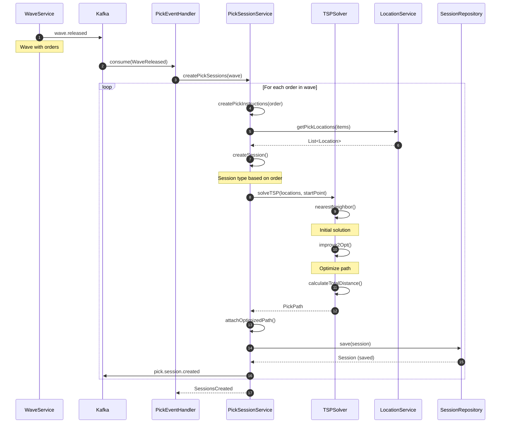
```mermaid
sequenceDiagram
    autonumber
    participant WaveService
    participant Kafka
    participant PickEventHandler
    participant PickSessionService
    participant TSPSolver
    participant LocationService
    participant SessionRepository

    WaveService->>Kafka: wave.released
    Note over WaveService: Wave with orders

    Kafka->>PickEventHandler: consume(WaveReleased)

    PickEventHandler->>PickSessionService: createPickSessions(wave)

    loop For each order in wave
        PickSessionService->>PickSessionService: createPickInstructions(order)
        PickSessionService->>LocationService: getPickLocations(items)
        LocationService-->>PickSessionService: List<Location>

        PickSessionService->>PickSessionService: createSession()
        Note over PickSessionService: Session type based on order

        PickSessionService->>TSPSolver: solveTSP(locations, startPoint)

        TSPSolver->>TSPSolver: nearestNeighbor()
        Note over TSPSolver: Initial solution

        TSPSolver->>TSPSolver: improve2Opt()
        Note over TSPSolver: Optimize path

        TSPSolver->>TSPSolver: calculateTotalDistance()
        TSPSolver-->>PickSessionService: PickPath

        PickSessionService->>PickSessionService: attachOptimizedPath()
        PickSessionService->>SessionRepository: save(session)
        SessionRepository-->>PickSessionService: Session (saved)

        PickSessionService->>Kafka: pick.session.created
    end

    PickSessionService-->>PickEventHandler: SessionsCreated
```

### Batch Pick Session Creation

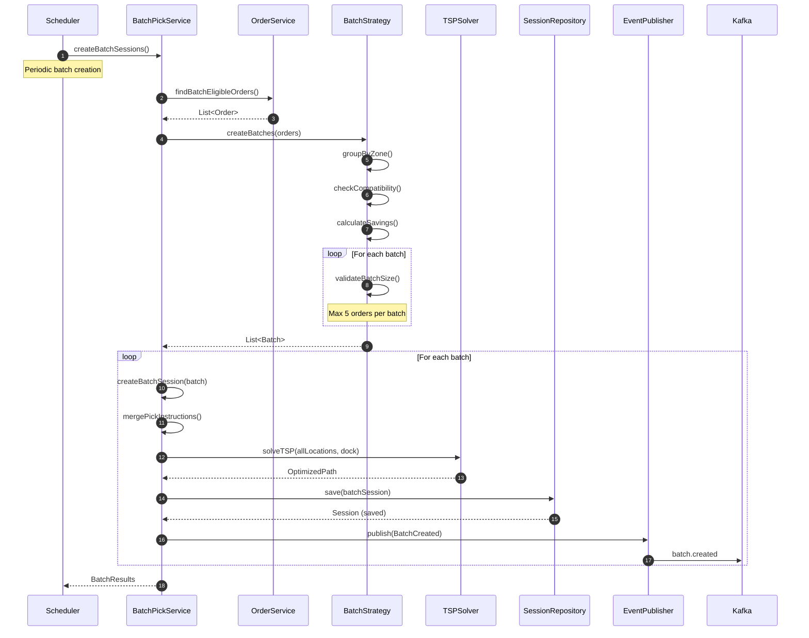
```mermaid
sequenceDiagram
    autonumber
    participant Scheduler
    participant BatchPickService
    participant OrderService
    participant BatchStrategy
    participant TSPSolver
    participant SessionRepository
    participant EventPublisher

    Scheduler->>BatchPickService: createBatchSessions()
    Note over Scheduler: Periodic batch creation

    BatchPickService->>OrderService: findBatchEligibleOrders()
    OrderService-->>BatchPickService: List<Order>

    BatchPickService->>BatchStrategy: createBatches(orders)

    BatchStrategy->>BatchStrategy: groupByZone()
    BatchStrategy->>BatchStrategy: checkCompatibility()
    BatchStrategy->>BatchStrategy: calculateSavings()

    loop For each batch
        BatchStrategy->>BatchStrategy: validateBatchSize()
        Note over BatchStrategy: Max 5 orders per batch
    end

    BatchStrategy-->>BatchPickService: List<Batch>

    loop For each batch
        BatchPickService->>BatchPickService: createBatchSession(batch)
        BatchPickService->>BatchPickService: mergePickInstructions()

        BatchPickService->>TSPSolver: solveTSP(allLocations, dock)
        TSPSolver-->>BatchPickService: OptimizedPath

        BatchPickService->>SessionRepository: save(batchSession)
        SessionRepository-->>BatchPickService: Session (saved)

        BatchPickService->>EventPublisher: publish(BatchCreated)
        EventPublisher->>Kafka: batch.created
    end

    BatchPickService-->>Scheduler: BatchResults
```

## 2. Path Optimization Flows

### Multi-Zone Path Optimization

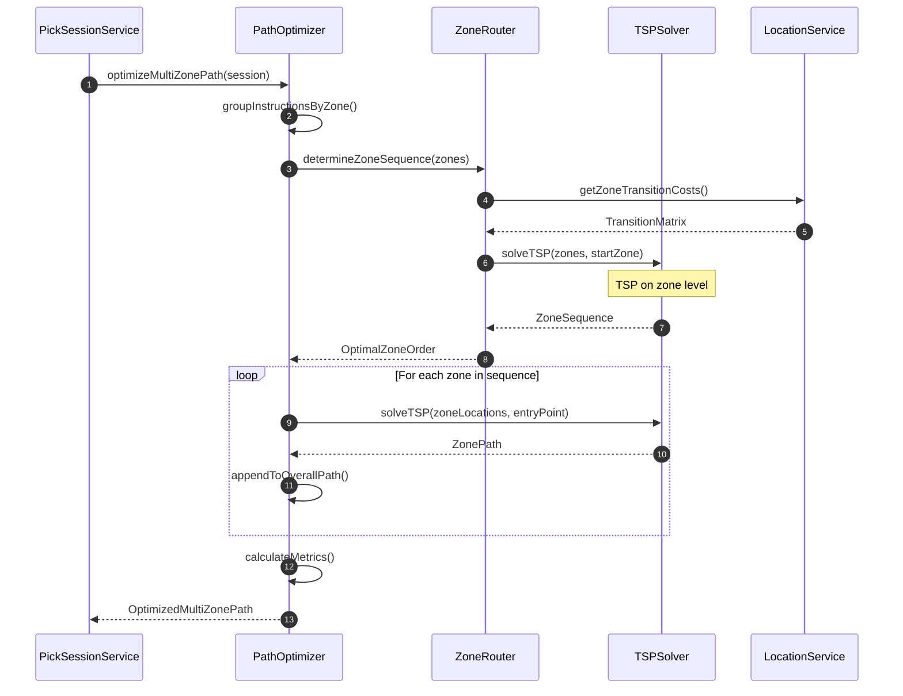
```mermaid
sequenceDiagram
    autonumber
    participant PickSessionService
    participant PathOptimizer
    participant ZoneRouter
    participant TSPSolver
    participant LocationService

    PickSessionService->>PathOptimizer: optimizeMultiZonePath(session)

    PathOptimizer->>PathOptimizer: groupInstructionsByZone()

    PathOptimizer->>ZoneRouter: determineZoneSequence(zones)

    ZoneRouter->>LocationService: getZoneTransitionCosts()
    LocationService-->>ZoneRouter: TransitionMatrix

    ZoneRouter->>TSPSolver: solveTSP(zones, startZone)
    Note over TSPSolver: TSP on zone level

    TSPSolver-->>ZoneRouter: ZoneSequence

    ZoneRouter-->>PathOptimizer: OptimalZoneOrder

    loop For each zone in sequence
        PathOptimizer->>TSPSolver: solveTSP(zoneLocations, entryPoint)
        TSPSolver-->>PathOptimizer: ZonePath

        PathOptimizer->>PathOptimizer: appendToOverallPath()
    end

    PathOptimizer->>PathOptimizer: calculateMetrics()
    PathOptimizer-->>PickSessionService: OptimizedMultiZonePath
```

### Serpentine Path Optimization

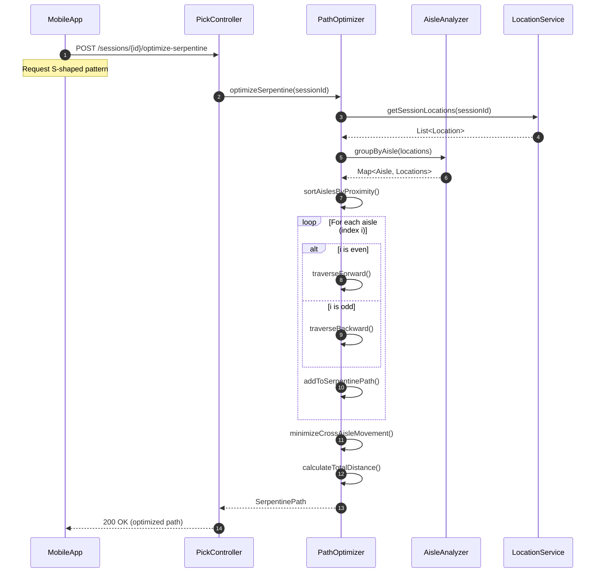
```mermaid
sequenceDiagram
    autonumber
    participant MobileApp
    participant PickController
    participant PathOptimizer
    participant AisleAnalyzer
    participant LocationService

    MobileApp->>PickController: POST /sessions/{id}/optimize-serpentine
    Note over MobileApp: Request S-shaped pattern

    PickController->>PathOptimizer: optimizeSerpentine(sessionId)

    PathOptimizer->>LocationService: getSessionLocations(sessionId)
    LocationService-->>PathOptimizer: List<Location>

    PathOptimizer->>AisleAnalyzer: groupByAisle(locations)
    AisleAnalyzer-->>PathOptimizer: Map<Aisle, Locations>

    PathOptimizer->>PathOptimizer: sortAislesByProximity()

    loop For each aisle (index i)
        alt i is even
            PathOptimizer->>PathOptimizer: traverseForward()
        else i is odd
            PathOptimizer->>PathOptimizer: traverseBackward()
        end

        PathOptimizer->>PathOptimizer: addToSerpentinePath()
    end

    PathOptimizer->>PathOptimizer: minimizeCrossAisleMovement()
    PathOptimizer->>PathOptimizer: calculateTotalDistance()

    PathOptimizer-->>PickController: SerpentinePath
    PickController-->>MobileApp: 200 OK (optimized path)
```

## 3. Pick Execution Flow

### Start Pick Session

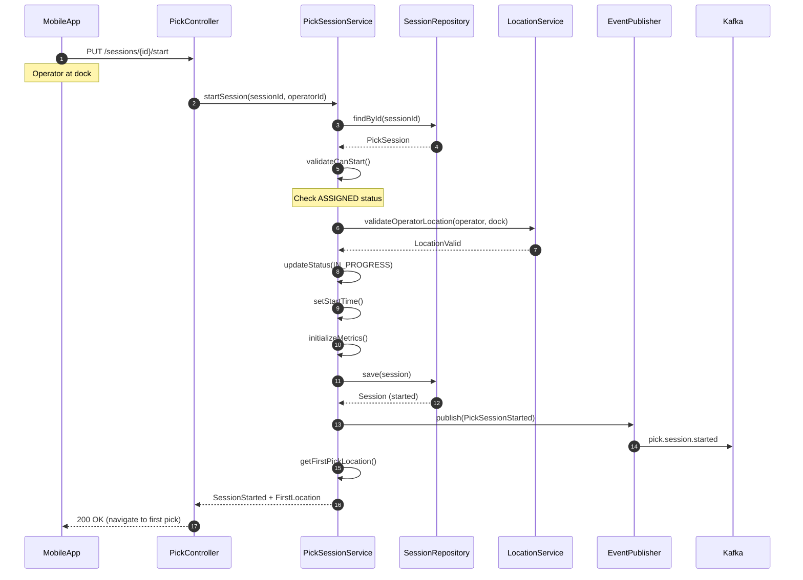
```mermaid
sequenceDiagram
    autonumber
    participant MobileApp
    participant PickController
    participant PickSessionService
    participant SessionRepository
    participant LocationService
    participant EventPublisher

    MobileApp->>PickController: PUT /sessions/{id}/start
    Note over MobileApp: Operator at dock

    PickController->>PickSessionService: startSession(sessionId, operatorId)

    PickSessionService->>SessionRepository: findById(sessionId)
    SessionRepository-->>PickSessionService: PickSession

    PickSessionService->>PickSessionService: validateCanStart()
    Note over PickSessionService: Check ASSIGNED status

    PickSessionService->>LocationService: validateOperatorLocation(operator, dock)
    LocationService-->>PickSessionService: LocationValid

    PickSessionService->>PickSessionService: updateStatus(IN_PROGRESS)
    PickSessionService->>PickSessionService: setStartTime()
    PickSessionService->>PickSessionService: initializeMetrics()

    PickSessionService->>SessionRepository: save(session)
    SessionRepository-->>PickSessionService: Session (started)

    PickSessionService->>EventPublisher: publish(PickSessionStarted)
    EventPublisher->>Kafka: pick.session.started

    PickSessionService->>PickSessionService: getFirstPickLocation()
    PickSessionService-->>PickController: SessionStarted + FirstLocation
    PickController-->>MobileApp: 200 OK (navigate to first pick)
```

### Confirm Pick

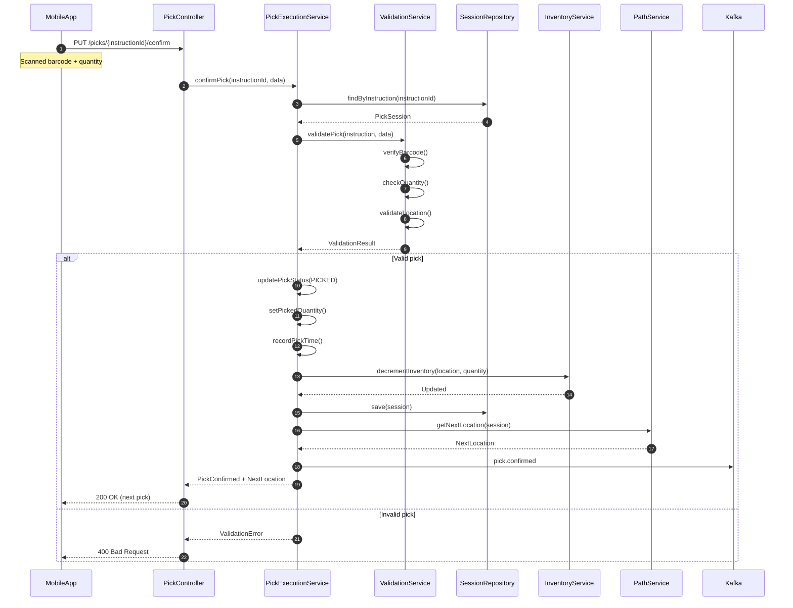
```mermaid
sequenceDiagram
    autonumber
    participant MobileApp
    participant PickController
    participant PickExecutionService
    participant ValidationService
    participant SessionRepository
    participant InventoryService
    participant PathService

    MobileApp->>PickController: PUT /picks/{instructionId}/confirm
    Note over MobileApp: Scanned barcode + quantity

    PickController->>PickExecutionService: confirmPick(instructionId, data)

    PickExecutionService->>SessionRepository: findByInstruction(instructionId)
    SessionRepository-->>PickExecutionService: PickSession

    PickExecutionService->>ValidationService: validatePick(instruction, data)

    ValidationService->>ValidationService: verifyBarcode()
    ValidationService->>ValidationService: checkQuantity()
    ValidationService->>ValidationService: validateLocation()

    ValidationService-->>PickExecutionService: ValidationResult

    alt Valid pick
        PickExecutionService->>PickExecutionService: updatePickStatus(PICKED)
        PickExecutionService->>PickExecutionService: setPickedQuantity()
        PickExecutionService->>PickExecutionService: recordPickTime()

        PickExecutionService->>InventoryService: decrementInventory(location, quantity)
        InventoryService-->>PickExecutionService: Updated

        PickExecutionService->>SessionRepository: save(session)

        PickExecutionService->>PathService: getNextLocation(session)
        PathService-->>PickExecutionService: NextLocation

        PickExecutionService->>Kafka: pick.confirmed

        PickExecutionService-->>PickController: PickConfirmed + NextLocation
        PickController-->>MobileApp: 200 OK (next pick)
    else Invalid pick
        PickExecutionService-->>PickController: ValidationError
        PickController-->>MobileApp: 400 Bad Request
    end
```

### Handle Pick Exception

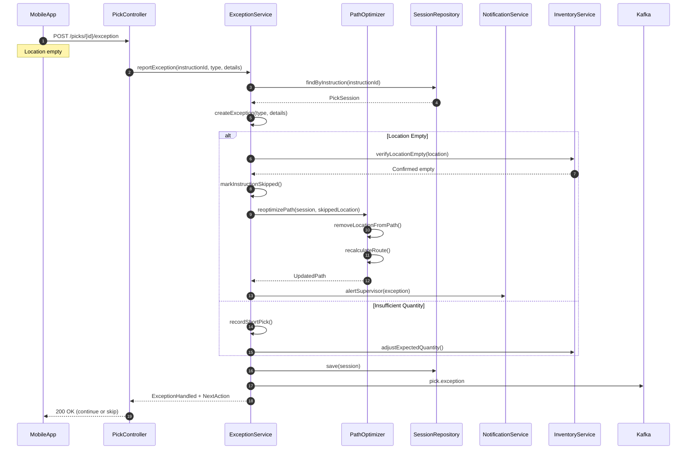
```mermaid
sequenceDiagram
    autonumber
    participant MobileApp
    participant PickController
    participant ExceptionService
    participant PathOptimizer
    participant SessionRepository
    participant NotificationService
    participant InventoryService

    MobileApp->>PickController: POST /picks/{id}/exception
    Note over MobileApp: Location empty

    PickController->>ExceptionService: reportException(instructionId, type, details)

    ExceptionService->>SessionRepository: findByInstruction(instructionId)
    SessionRepository-->>ExceptionService: PickSession

    ExceptionService->>ExceptionService: createException(type, details)

    alt Location Empty
        ExceptionService->>InventoryService: verifyLocationEmpty(location)
        InventoryService-->>ExceptionService: Confirmed empty

        ExceptionService->>ExceptionService: markInstructionSkipped()

        ExceptionService->>PathOptimizer: reoptimizePath(session, skippedLocation)

        PathOptimizer->>PathOptimizer: removeLocationFromPath()
        PathOptimizer->>PathOptimizer: recalculateRoute()
        PathOptimizer-->>ExceptionService: UpdatedPath

        ExceptionService->>NotificationService: alertSupervisor(exception)

    else Insufficient Quantity
        ExceptionService->>ExceptionService: recordShortPick()
        ExceptionService->>InventoryService: adjustExpectedQuantity()
    end

    ExceptionService->>SessionRepository: save(session)

    ExceptionService->>Kafka: pick.exception

    ExceptionService-->>PickController: ExceptionHandled + NextAction
    PickController-->>MobileApp: 200 OK (continue or skip)
```

## 4. Dynamic Path Adjustment

### Real-time Path Re-optimization

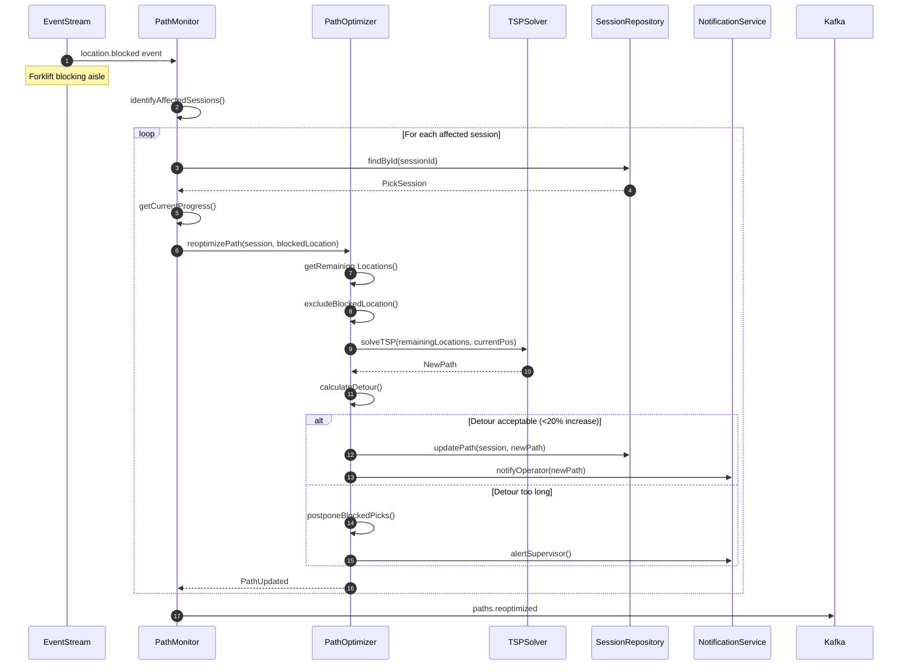
```mermaid
sequenceDiagram
    autonumber
    participant EventStream
    participant PathMonitor
    participant PathOptimizer
    participant TSPSolver
    participant SessionRepository
    participant NotificationService

    EventStream->>PathMonitor: location.blocked event
    Note over EventStream: Forklift blocking aisle

    PathMonitor->>PathMonitor: identifyAffectedSessions()

    loop For each affected session
        PathMonitor->>SessionRepository: findById(sessionId)
        SessionRepository-->>PathMonitor: PickSession

        PathMonitor->>PathMonitor: getCurrentProgress()

        PathMonitor->>PathOptimizer: reoptimizePath(session, blockedLocation)

        PathOptimizer->>PathOptimizer: getRemaining Locations()
        PathOptimizer->>PathOptimizer: excludeBlockedLocation()

        PathOptimizer->>TSPSolver: solveTSP(remainingLocations, currentPos)
        TSPSolver-->>PathOptimizer: NewPath

        PathOptimizer->>PathOptimizer: calculateDetour()

        alt Detour acceptable (<20% increase)
            PathOptimizer->>SessionRepository: updatePath(session, newPath)
            PathOptimizer->>NotificationService: notifyOperator(newPath)
        else Detour too long
            PathOptimizer->>PathOptimizer: postponeBlockedPicks()
            PathOptimizer->>NotificationService: alertSupervisor()
        end

        PathOptimizer-->>PathMonitor: PathUpdated
    end

    PathMonitor->>Kafka: paths.reoptimized
```

### Batch Pick Split

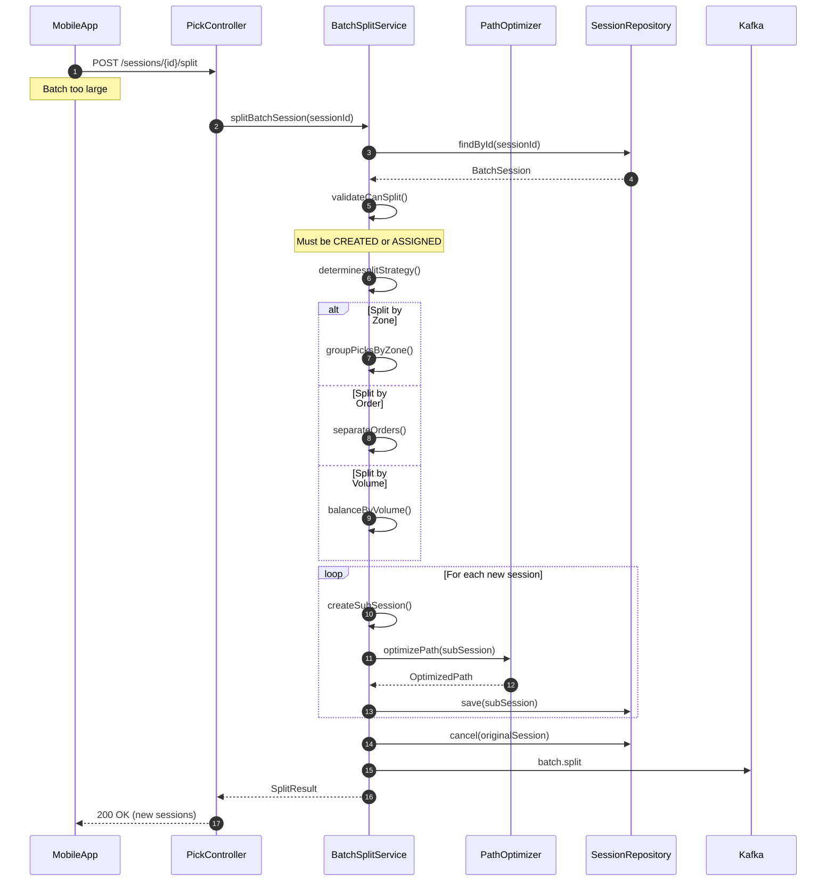
```mermaid
sequenceDiagram
    autonumber
    participant MobileApp
    participant PickController
    participant BatchSplitService
    participant PathOptimizer
    participant SessionRepository

    MobileApp->>PickController: POST /sessions/{id}/split
    Note over MobileApp: Batch too large

    PickController->>BatchSplitService: splitBatchSession(sessionId)

    BatchSplitService->>SessionRepository: findById(sessionId)
    SessionRepository-->>BatchSplitService: BatchSession

    BatchSplitService->>BatchSplitService: validateCanSplit()
    Note over BatchSplitService: Must be CREATED or ASSIGNED

    BatchSplitService->>BatchSplitService: determinesplitStrategy()

    alt Split by Zone
        BatchSplitService->>BatchSplitService: groupPicksByZone()
    else Split by Order
        BatchSplitService->>BatchSplitService: separateOrders()
    else Split by Volume
        BatchSplitService->>BatchSplitService: balanceByVolume()
    end

    loop For each new session
        BatchSplitService->>BatchSplitService: createSubSession()

        BatchSplitService->>PathOptimizer: optimizePath(subSession)
        PathOptimizer-->>BatchSplitService: OptimizedPath

        BatchSplitService->>SessionRepository: save(subSession)
    end

    BatchSplitService->>SessionRepository: cancel(originalSession)

    BatchSplitService->>Kafka: batch.split

    BatchSplitService-->>PickController: SplitResult
    PickController-->>MobileApp: 200 OK (new sessions)
```

## 5. Session Completion Flow

### Complete Pick Session

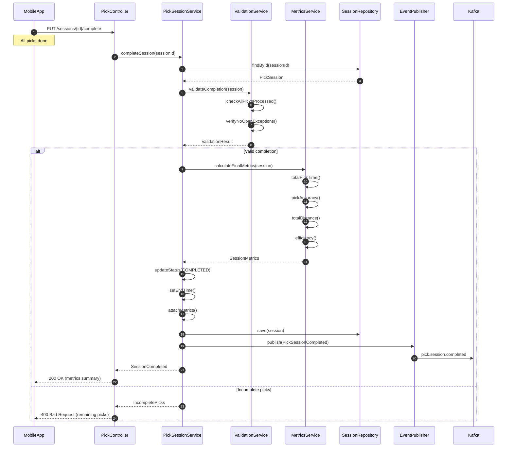
```mermaid
sequenceDiagram
    autonumber
    participant MobileApp
    participant PickController
    participant PickSessionService
    participant ValidationService
    participant MetricsService
    participant SessionRepository
    participant EventPublisher

    MobileApp->>PickController: PUT /sessions/{id}/complete
    Note over MobileApp: All picks done

    PickController->>PickSessionService: completeSession(sessionId)

    PickSessionService->>SessionRepository: findById(sessionId)
    SessionRepository-->>PickSessionService: PickSession

    PickSessionService->>ValidationService: validateCompletion(session)

    ValidationService->>ValidationService: checkAllPicksProcessed()
    ValidationService->>ValidationService: verifyNoOpenExceptions()
    ValidationService-->>PickSessionService: ValidationResult

    alt Valid completion
        PickSessionService->>MetricsService: calculateFinalMetrics(session)

        MetricsService->>MetricsService: totalPickTime()
        MetricsService->>MetricsService: pickAccuracy()
        MetricsService->>MetricsService: totalDistance()
        MetricsService->>MetricsService: efficiency()

        MetricsService-->>PickSessionService: SessionMetrics

        PickSessionService->>PickSessionService: updateStatus(COMPLETED)
        PickSessionService->>PickSessionService: setEndTime()
        PickSessionService->>PickSessionService: attachMetrics()

        PickSessionService->>SessionRepository: save(session)

        PickSessionService->>EventPublisher: publish(PickSessionCompleted)
        EventPublisher->>Kafka: pick.session.completed

        PickSessionService-->>PickController: SessionCompleted
        PickController-->>MobileApp: 200 OK (metrics summary)
    else Incomplete picks
        PickSessionService-->>PickController: IncompletePicks
        PickController-->>MobileApp: 400 Bad Request (remaining picks)
    end
```

## 6. Performance Monitoring

### Real-time Performance Tracking

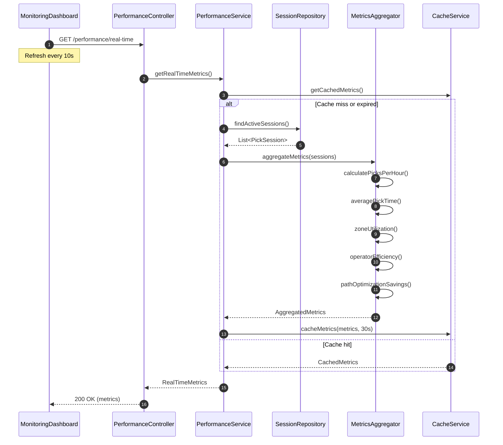
```mermaid
sequenceDiagram
    autonumber
    participant MonitoringDashboard
    participant PerformanceController
    participant PerformanceService
    participant SessionRepository
    participant MetricsAggregator
    participant CacheService

    MonitoringDashboard->>PerformanceController: GET /performance/real-time
    Note over MonitoringDashboard: Refresh every 10s

    PerformanceController->>PerformanceService: getRealTimeMetrics()

    PerformanceService->>CacheService: getCachedMetrics()

    alt Cache miss or expired
        PerformanceService->>SessionRepository: findActiveSessions()
        SessionRepository-->>PerformanceService: List<PickSession>

        PerformanceService->>MetricsAggregator: aggregateMetrics(sessions)

        MetricsAggregator->>MetricsAggregator: calculatePicksPerHour()
        MetricsAggregator->>MetricsAggregator: averagePickTime()
        MetricsAggregator->>MetricsAggregator: zoneUtilization()
        MetricsAggregator->>MetricsAggregator: operatorEfficiency()
        MetricsAggregator->>MetricsAggregator: pathOptimizationSavings()

        MetricsAggregator-->>PerformanceService: AggregatedMetrics

        PerformanceService->>CacheService: cacheMetrics(metrics, 30s)
    else Cache hit
        CacheService-->>PerformanceService: CachedMetrics
    end

    PerformanceService-->>PerformanceController: RealTimeMetrics
    PerformanceController-->>MonitoringDashboard: 200 OK (metrics)
```

### Path Optimization Analytics

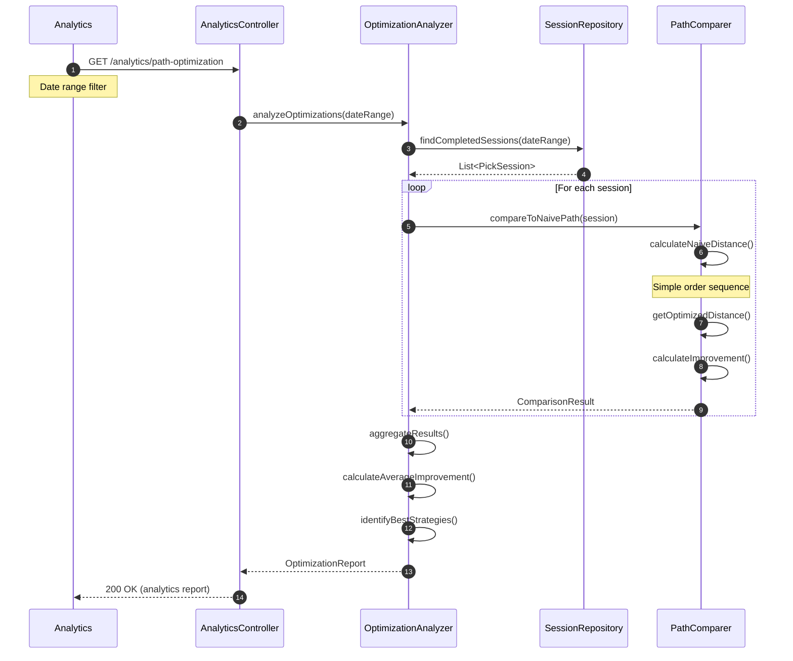
```mermaid
sequenceDiagram
    autonumber
    participant Analytics
    participant AnalyticsController
    participant OptimizationAnalyzer
    participant SessionRepository
    participant PathComparer

    Analytics->>AnalyticsController: GET /analytics/path-optimization
    Note over Analytics: Date range filter

    AnalyticsController->>OptimizationAnalyzer: analyzeOptimizations(dateRange)

    OptimizationAnalyzer->>SessionRepository: findCompletedSessions(dateRange)
    SessionRepository-->>OptimizationAnalyzer: List<PickSession>

    loop For each session
        OptimizationAnalyzer->>PathComparer: compareToNaivePath(session)

        PathComparer->>PathComparer: calculateNaiveDistance()
        Note over PathComparer: Simple order sequence

        PathComparer->>PathComparer: getOptimizedDistance()
        PathComparer->>PathComparer: calculateImprovement()

        PathComparer-->>OptimizationAnalyzer: ComparisonResult
    end

    OptimizationAnalyzer->>OptimizationAnalyzer: aggregateResults()
    OptimizationAnalyzer->>OptimizationAnalyzer: calculateAverageImprovement()
    OptimizationAnalyzer->>OptimizationAnalyzer: identifyBestStrategies()

    OptimizationAnalyzer-->>AnalyticsController: OptimizationReport
    AnalyticsController-->>Analytics: 200 OK (analytics report)
```

## 7. Integration Events

### Order Priority Change Handling

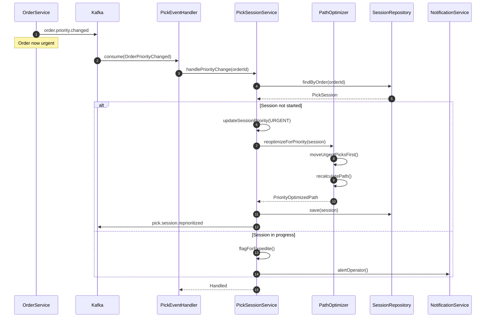
```mermaid
sequenceDiagram
    autonumber
    participant OrderService
    participant Kafka
    participant PickEventHandler
    participant PickSessionService
    participant PathOptimizer
    participant SessionRepository

    OrderService->>Kafka: order.priority.changed
    Note over OrderService: Order now urgent

    Kafka->>PickEventHandler: consume(OrderPriorityChanged)

    PickEventHandler->>PickSessionService: handlePriorityChange(orderId)

    PickSessionService->>SessionRepository: findByOrder(orderId)
    SessionRepository-->>PickSessionService: PickSession

    alt Session not started
        PickSessionService->>PickSessionService: updateSessionPriority(URGENT)

        PickSessionService->>PathOptimizer: reoptimizeForPriority(session)

        PathOptimizer->>PathOptimizer: moveUrgentPicksFirst()
        PathOptimizer->>PathOptimizer: recalculatePath()

        PathOptimizer-->>PickSessionService: PriorityOptimizedPath

        PickSessionService->>SessionRepository: save(session)
        PickSessionService->>Kafka: pick.session.reprioritized
    else Session in progress
        PickSessionService->>PickSessionService: flagForExpedite()
        PickSessionService->>NotificationService: alertOperator()
    end

    PickSessionService-->>PickEventHandler: Handled
```

## Error Handling Patterns

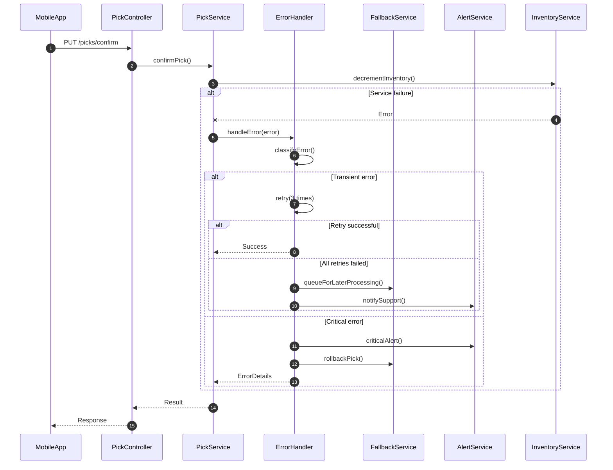
```mermaid
sequenceDiagram
    autonumber
    participant MobileApp
    participant PickController
    participant PickService
    participant ErrorHandler
    participant FallbackService
    participant AlertService

    MobileApp->>PickController: PUT /picks/confirm

    PickController->>PickService: confirmPick()

    PickService->>InventoryService: decrementInventory()

    alt Service failure
        InventoryService--x PickService: Error

        PickService->>ErrorHandler: handleError(error)

        ErrorHandler->>ErrorHandler: classifyError()

        alt Transient error
            ErrorHandler->>ErrorHandler: retry(3 times)

            alt Retry successful
                ErrorHandler-->>PickService: Success
            else All retries failed
                ErrorHandler->>FallbackService: queueForLaterProcessing()
                ErrorHandler->>AlertService: notifySupport()
            end
        else Critical error
            ErrorHandler->>AlertService: criticalAlert()
            ErrorHandler->>FallbackService: rollbackPick()
            ErrorHandler-->>PickService: ErrorDetails
        end
    end

    PickService-->>PickController: Result
    PickController-->>MobileApp: Response
```

## Key Interaction Patterns

1. **Path Optimization**: TSP solver with 2-opt improvement for all paths
2. **Real-time Adjustments**: Dynamic re-routing on exceptions
3. **Batch Processing**: Combine compatible orders for efficiency
4. **Zone Optimization**: Minimize zone transitions
5. **Performance Caching**: Cache paths and metrics for performance
6. **Event-Driven Updates**: React to order changes and exceptions
7. **Fallback Strategies**: Handle failures gracefully with alternatives