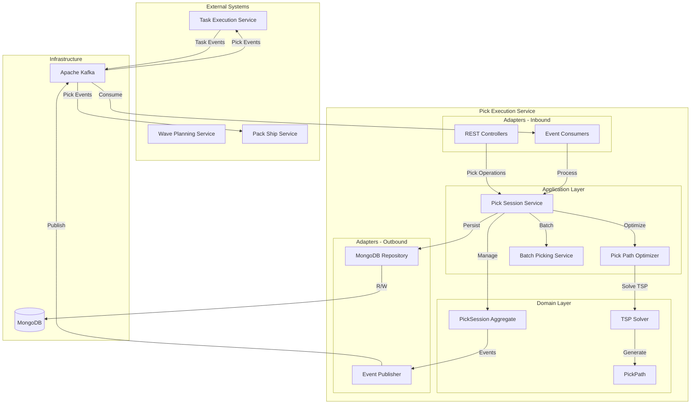

# Pick Execution Service - Architecture

Comprehensive overview of the Pick Execution Service architecture with TSP-based path optimization and intelligent batch picking.

## High-Level System Architecture



## TSP Algorithm Implementation

### 2-opt Algorithm

```java
public PickPath improve2Opt(List<PickLocation> path, PickLocation start) {
    boolean improved = true;
    int iteration = 0;
    double currentDistance = calculateTotalDistance(path);

    while (improved && iteration < maxIterations) {
        improved = false;
        iteration++;

        for (int i = 0; i < path.size() - 1; i++) {
            for (int j = i + 2; j < path.size(); j++) {
                // Calculate new distance after 2-opt swap
                double newDistance = calculateSwapDistance(path, i, j);

                // If improvement found
                if (newDistance < currentDistance * (1 - improvementThreshold)) {
                    // Reverse segment between i+1 and j
                    Collections.reverse(path.subList(i + 1, j + 1));
                    currentDistance = newDistance;
                    improved = true;
                }
            }
        }
    }

    return buildPickPath(path, start, currentDistance);
}
```

### Nearest Neighbor Algorithm

```java
public List<PickLocation> nearestNeighbor(List<PickLocation> locations, PickLocation start) {
    List<PickLocation> path = new ArrayList<>();
    List<PickLocation> remaining = new ArrayList<>(locations);
    PickLocation current = start;

    while (!remaining.isEmpty()) {
        PickLocation nearest = findNearestLocation(current, remaining);
        path.add(nearest);
        remaining.remove(nearest);
        current = nearest;
    }

    return path;
}
```

## Application Services

### Pick Session Service
- `createSession(SessionRequest)` - Create pick session
- `assignOperator(String sessionId, String operatorId)` - Assign operator
- `startSession(String sessionId)` - Start with optimized path
- `confirmPick(String sessionId, String instructionId, int quantity)` - Confirm pick
- `skipLocation(String sessionId, String instructionId, String reason)` - Skip location
- `completeSession(String sessionId)` - Complete session
- `pauseSession(String sessionId)` - Pause session
- `resumeSession(String sessionId)` - Resume session

### Pick Path Optimizer
- `optimizePath(PickSession, Location start)` - TSP optimization
- `optimizeBatchPicking(List<PickSession>)` - Multi-order batch
- `optimizeSerpentine(List<Location>)` - S-shaped aisle pattern
- `reoptimizePath(PickPath, Location failed, Location current)` - Dynamic re-route

### Batch Picking Service
- `createBatch(List<Order>)` - Create batch pick session
- `evaluateEfficiency(BatchCandidate)` - Calculate batch savings
- `splitBatch(PickSession)` - Split large batches
- `consolidateOrders(List<Order>)` - Merge compatible orders

## Path Optimization Strategies

### Shortest Distance (TSP)
1. Generate initial solution using Nearest Neighbor
2. Improve with 2-opt algorithm
3. Continue until no improvement or max iterations

### Zone Optimized
1. Group picks by zone
2. Calculate zone transition costs
3. Find optimal zone sequence (TSP on zones)
4. Optimize within each zone
5. Combine into final path

### Serpentine Pattern
1. Sort aisles by proximity
2. For each aisle:
   - Even aisles: traverse forward
   - Odd aisles: traverse backward
3. Minimize cross-aisle movement

### Priority Based
1. Identify urgent picks (carrier cutoff, SLA)
2. Place urgent picks first in path
3. Optimize remaining picks
4. Validate total distance increase < threshold

## Database Design

### PickSession Collection

```json
{
  "_id": "session-12345",
  "warehouseId": "warehouse-1",
  "type": "BATCH_PICK",
  "status": "IN_PROGRESS",
  "operatorId": "operator-123",
  "orderIds": ["order-1", "order-2"],
  "instructions": [
    {
      "instructionId": "pick-1",
      "orderId": "order-1",
      "productId": "product-abc",
      "sku": "SKU-001",
      "requiredQuantity": 5,
      "pickedQuantity": 5,
      "pickLocation": {
        "locationId": "A1-01-02",
        "zone": "A1",
        "aisle": "01",
        "bay": "02",
        "coordinates": { "x": 10.5, "y": 20.3, "z": 1.2 }
      },
      "status": "PICKED",
      "pickTime": "2025-10-19T10:15:00Z"
    }
  ],
  "optimizedPath": {
    "pathId": "path-789",
    "nodes": [...],
    "totalDistance": 850.5,
    "estimatedTime": 3600,
    "strategy": "ZONE_OPTIMIZED",
    "calculatedAt": "2025-10-19T10:00:00Z"
  },
  "metrics": {
    "totalPicks": 25,
    "completedPicks": 15,
    "skippedPicks": 1,
    "pickAccuracy": 0.96,
    "totalTime": 2100,
    "averagePickTime": 140,
    "totalDistance": 520.3,
    "efficiency": 0.85
  },
  "startTime": "2025-10-19T10:00:00Z"
}
```

### MongoDB Indexes

```javascript
db.pickSessions.createIndex({ "operatorId": 1, "status": 1 })
db.pickSessions.createIndex({ "warehouseId": 1, "status": 1, "startTime": 1 })
db.pickSessions.createIndex({ "orderIds": 1 })
db.pickSessions.createIndex({ "status": 1, "startTime": 1 })
```

## Event Schema

### PickConfirmed Event

```json
{
  "specversion": "1.0",
  "type": "com.paklog.pick.confirmed",
  "source": "pick-execution-service",
  "id": "event-uuid",
  "time": "2025-10-19T10:15:00Z",
  "data": {
    "sessionId": "session-12345",
    "instructionId": "pick-1",
    "orderId": "order-1",
    "productId": "product-abc",
    "sku": "SKU-001",
    "pickedQuantity": 5,
    "pickLocation": {
      "locationId": "A1-01-02",
      "zone": "A1"
    },
    "operatorId": "operator-123",
    "pickTime": "2025-10-19T10:15:00Z"
  }
}
```

## Configuration

```yaml
# Pick Optimization Configuration
pick:
  optimization:
    algorithm: TSP  # TSP, ZONE, SERPENTINE, PRIORITY
    max-iterations: 100
    improvement-threshold: 0.01
  batch:
    max-orders: 5
    max-distance-increase: 0.20  # 20%
    allow-mixed-zones: false
  cache:
    location-distance-ttl: 24h
    path-ttl: 1h
  session:
    max-picks-per-operator: 50
    max-pause-duration: 30m

# MongoDB Configuration
spring:
  data:
    mongodb:
      uri: mongodb://localhost:27017/pick-execution
      auto-index-creation: true
```

## Performance Optimizations

### TSP Algorithm Performance
- **Time Complexity**: O(n² × k) where k = iterations
- **Max Iterations**: 100 (configurable)
- **Improvement Threshold**: 1% minimum
- **Early Termination**: Stop on perfect solution

### Caching Strategy
- Location distances cached for 24 hours
- Zone transition costs cached indefinitely
- Path calculations cached for 1 hour
- Operator capabilities cached for 5 minutes

### Database Optimization
- Compound indexes for common queries
- Geospatial index on location coordinates
- Projection queries for minimal data transfer
- Connection pooling

## Monitoring Metrics

- Session creation rate
- Path optimization duration
- Average pick time per line
- Pick accuracy percentage
- Path distance vs. actual distance
- Batch efficiency percentage
- Exception rate by type
- Operator productivity (picks/hour)
